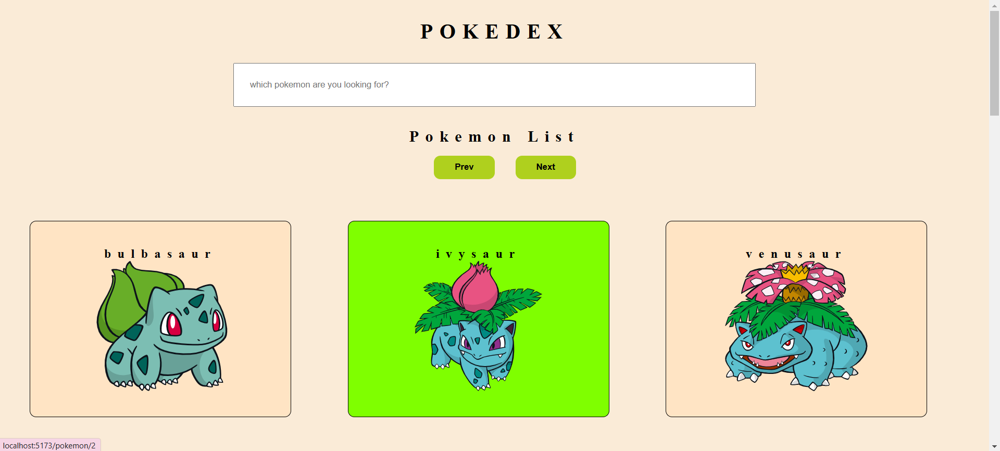
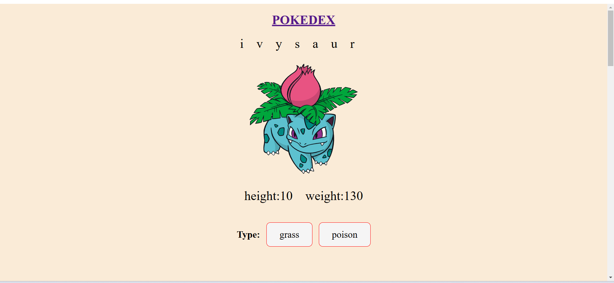
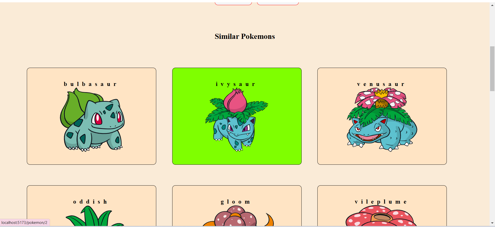

# Pokemon Pokedex Application

## Description

A dynamic Pokemon Pokedex application built using React and React Router. This application allows users to browse and search for Pokemon, view detailed information about each Pokemon, and see similar Pokemon.

## Features

- **Routing:** Implemented client-side routing with `react-router-dom` to navigate between the main Pokedex and detailed Pokemon views.
- **Dynamic URL Handling:** Used `useParams` to extract Pokemon ID from the URL for fetching specific Pokemon details.
- **Data Fetching:** Utilized Axios to call the PokeAPI for fetching Pokemon data.
- **Custom Hooks:** Created custom hooks for state management and data fetching.
- **Debouncing:** Applied debouncing for optimized search functionality.
- **Responsive Design:** Styled components using CSS for a responsive and user-friendly interface.

## Technologies Used

- React
- React Router
- Axios
- JavaScript
- CSS
- PokeAPI

## Usage

- Navigate to the main Pokedex view to browse and search for Pokemon.
- Click on a Pokemon to view detailed information.
- Use the search bar to find specific Pokemon with debounced search functionality.

## Screenshots

### Main Pokedex View

### Pokemon Details View

### Similar Pokemon List

## License

This project is licensed under the MIT License.